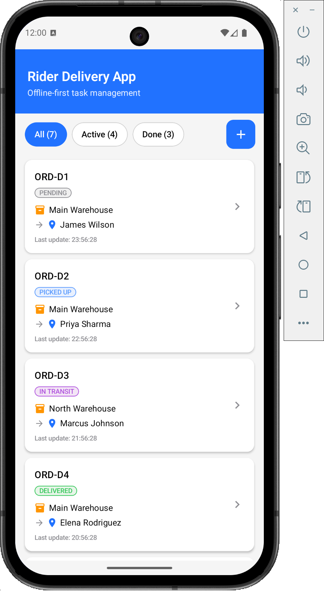
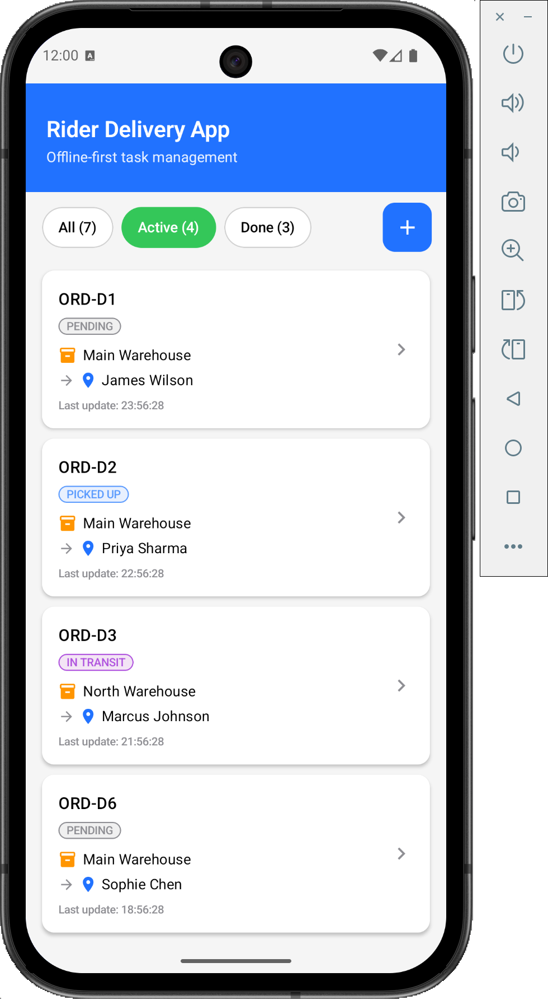
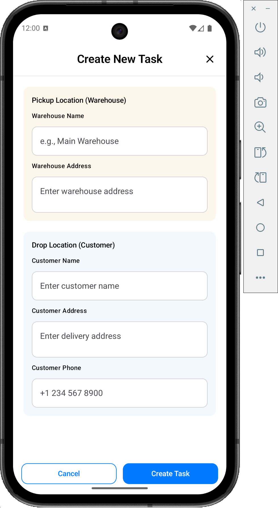
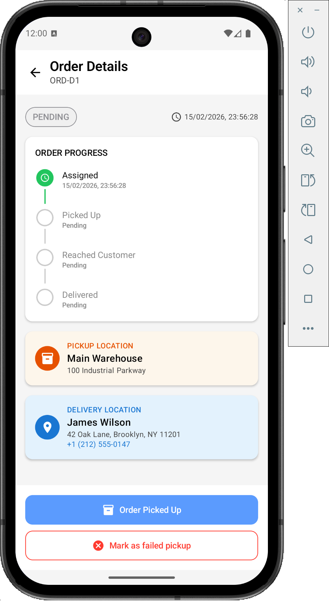
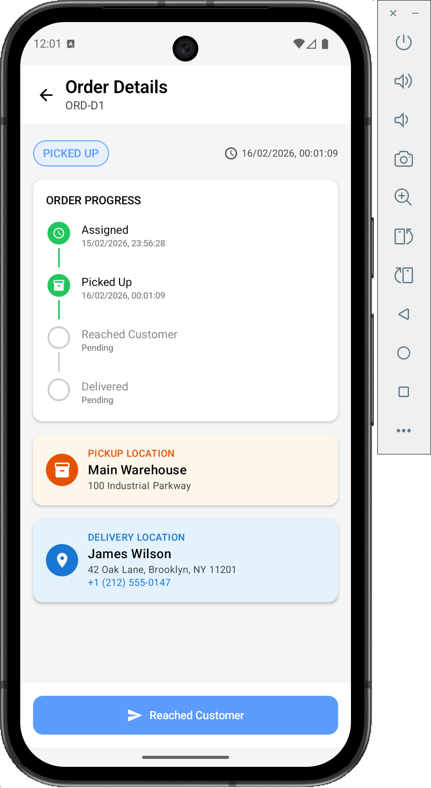
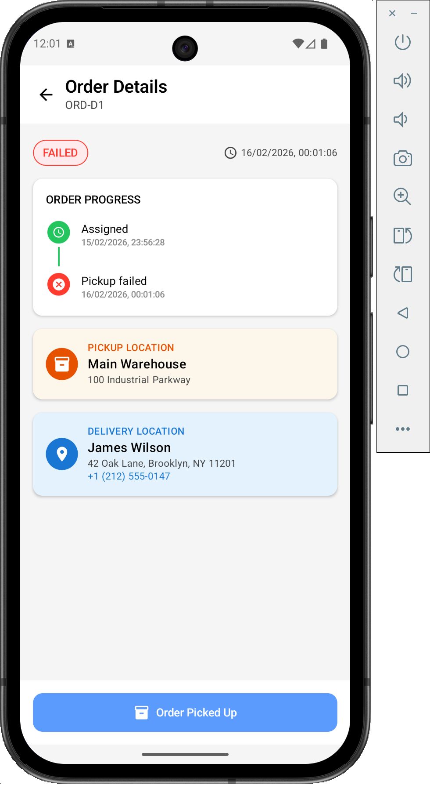
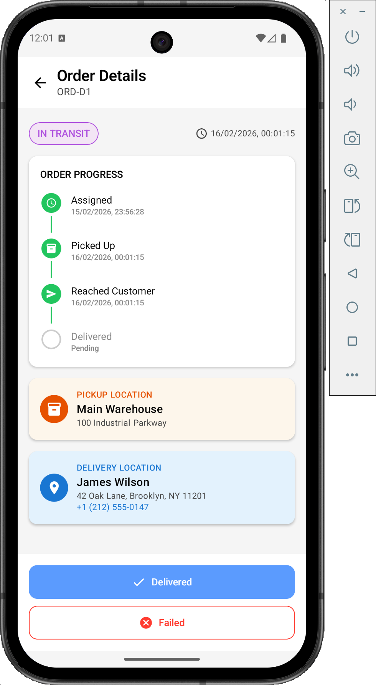
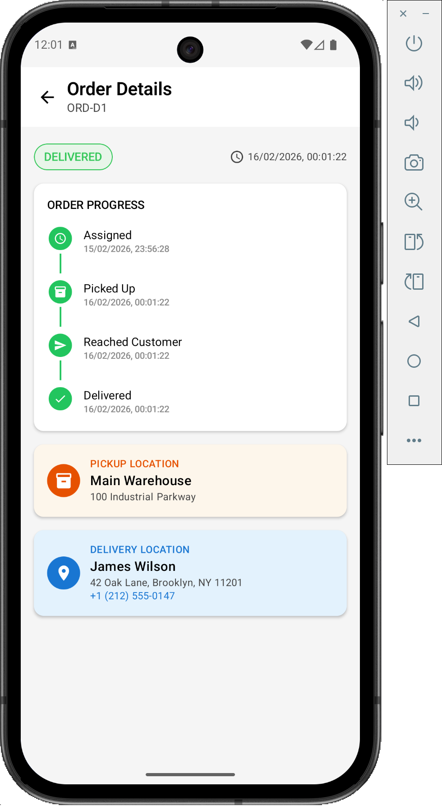
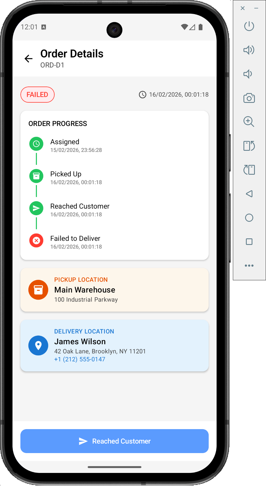

# DeliveryTrackingApp

---

## Table of Contents

1. [Architecture](#architecture)
2. [Tech Design Decisions](#tech-design-decisions)
3. [Functional Flow](#functional-flow)
4. [Data Flow](#data-flow)
5. [Tech Stack](#tech-stack)
6. [How to Run](#how-to-run)
7. [Project Working Summary](#project-working-summary)
8. [Failure Handling](#failure-handling)
9. [Project Structure](#project-structure)
10. [API Endpoints](#api-endpoints)
11. [Database Schema](#database-schema)
12. [Observability & Monitoring](#observability--monitoring)
13. [AI-Assisted Development](#ai-assisted-development)
14. [Screenshots](#screenshots)

---

## Architecture

The app follows **Clean Architecture** with clear layer boundaries and **offline-first** as the core principle.

### High-Level Principles

| Principle | Description |
|-----------|-------------|
| **Offline-first** | Room is the single source of truth. All reads come from Room; all writes go to Room first (and to the outbox for actions that must be synced). |
| **Outbox pattern** | Task action events (e.g. PICKED_UP, DELIVERED) are written to `task_action_events` with `syncStatus = PENDING`. The sync engine is the only component that reads PENDING events and pushes them to the API. |
| **No direct UI → Network** | No ViewModel or UI component calls the API. All network access is centralized in the **sync layer** (WorkManager → SyncWorker → SyncEngine → SyncOrchestrator → DeliveryApi). |

### Layer Overview

```
┌──────────────────────────────────────────────────────────────────┐
│  Presentation (Compose + MVI)                                    │
│  Screens, ViewModels, State, Intent → UI only talks to ViewModel │
└───────────────────────────────┬──────────────────────────────────┘
                                │
┌───────────────────────────────▼─────────────────────────────────┐
│  Domain                                                         │
│  Models, Repository interfaces, Use cases (business logic)      │
└───────────────────────────────┬─────────────────────────────────┘
                                │
┌───────────────────────────────▼─────────────────────────────────┐
│  Data                                                           │
│  Room (entities, DAOs), Retrofit (API, DTOs), Repo impls,       │
│  SyncEngine, SyncOrchestrator, SyncWorker                       │
└─────────────────────────────────────────────────────────────────┘
```

- **Presentation** depends only on **domain** (use cases, models).
- **Data** implements domain interfaces (repositories) and contains all I/O (DB, network, sync).

---

## Tech Design Decisions

| Decision | Rationale |
|----------|-----------|
| **MVI (Intent → ViewModel → State → UI)** | Single-direction data flow; state is predictable and easy to test. Intents map to user/system actions; state is immutable and rendered by Compose. |
| **Use cases per feature** | Each user-facing operation (e.g. `UpdateTaskStatusUseCase`, `CreatePickupTaskUseCase`) is a small class. Keeps ViewModels thin and logic testable in isolation. |
| **Repository over DAOs** | Domain layer depends on `DeliveryRepository` and `OutboxRepository` interfaces, not Room. Swapping or mocking data sources is straightforward. |
| **Outbox for actions only** | Only task actions (status updates, create pickup) go through the outbox. Delivery list fetch is a pull in the sync engine (GET /deliveries), not stored in outbox. |
| **Full sync vs outbox-only** | After a task action, `TriggerSyncUseCase` enqueues a one-time sync with `full_sync = false` (outbox-only, no GET /deliveries). Periodic and manual sync use `full_sync = true` and also fetch deliveries. |
| **Central logging (AppLogger)** | All components log via `AppLogger` so that sampling, redaction, or crash attachment can be added in one place. |
| **Generic Monitor interface** | Observability (events, metrics, breadcrumbs) goes through a `Monitor` interface. Current implementation uses `Log.i`; can be extended to analytics/crash/APM without changing call sites. |
| **Hilt for DI** | Single composition root; ViewModels, repositories, sync, and API are injected. SyncWorker gets dependencies from `Application` because WorkManager creates it by reflection. |

---

## Functional Flow

### 1. What the user can do

- **Tasks screen** → See list of tasks (from local DB). Tap a task → open **Task detail**. Tap “Create” → open **Create task** form.
- **Task detail** → See one delivery and its tasks. Tap an action (e.g. Picked up, Delivered) → action is saved **locally** and queued for sync.
- **Create task** → Fill form and submit → new delivery/task is saved **locally** and queued for sync.

Everything the user does is written to the **local database (Room)** first. The UI never talks to the server directly.

### 2. How sync works (simple)

- **When:** Sync runs in the background when:
  - the app’s 15‑minute timer fires, or
  - right after the user performs an action (e.g. Picked up) or creates a task.
- **What:** A background job (SyncWorker) runs. It (1) reads **pending** actions from a local “outbox” table, (2) sends them to the server (e.g. POST /tasks/action), (3) marks them as synced in the DB. If “full sync” is requested (periodic or manual), it also (4) fetches the latest deliveries from the server and saves them to Room.
- **Result:** Local data and server stay in sync without the user waiting; the list and detail screens always read from Room.

### 3. Flow in one sentence

**User action** → **ViewModel** → **Use case** → **Room (+ outbox)** → **Background sync** (when possible) sends outbox to **API** and, on full sync, pulls deliveries back into **Room**; **UI** always reads from **Room**.

---

## Data Flow

### Writes (User Actions)

1. **UI** → ViewModel handles **Intent** (e.g. `PerformAction`, `Create`).
2. **ViewModel** → calls **UseCase** (e.g. `UpdateTaskStatusUseCase`, `CreatePickupTaskUseCase`).
3. **UseCase** → **Repository** (DeliveryRepository + OutboxRepository for actions).
4. **Repository** → **Room**: insert/update entities; for task actions, also insert into `task_action_events` with `syncStatus = PENDING`.
5. Optionally, ViewModel calls **TriggerSyncUseCase** to enqueue a one-time **outbox-only** sync (no GET /deliveries).

**No API is called from the UI/ViewModel path.**

### Sync (Background)

1. **WorkManager** runs **SyncWorker** (periodic 15 min or one-time after action).
2. **SyncWorker** → **SyncEngine.sync(fetchDeliveries)**.
3. **SyncEngine** → **SyncOrchestrator.syncPendingEvents()**:
   - Read up to `outboxBatchSize` PENDING (or FAILED) events.
   - Split into CREATE_PICKUP vs status actions.
   - CREATE_PICKUP → POST `/tasks/create` (bulk); status actions → POST `/tasks/action` (batch).
   - On success: mark events SYNCED; on HTTP/client failure: mark FAILED or retry with backoff.
4. If `fetchDeliveries == true`: **SyncEngine** → GET `/deliveries` → map to domain → **DeliveryRepository.insertDeliveriesFromSync()** → Room.

### Reads

1. **UI** observes ViewModel **State** (e.g. `StateFlow<TasksState>`).
2. **ViewModel** subscribes to **UseCase** (e.g. `ObserveAllTasksUseCase()` returning Flow).
3. **UseCase** → **Repository** → **Room** (DAOs return Flow/LiveData or suspend).
4. Room is the **single source of truth**; UI never reads from the API directly.

---

## Tech Stack

| Category | Technology | Version (or BOM) |
|----------|------------|-------------------|
| Language | Kotlin | 1.9.24 |
| Min SDK | Android | 26 |
| Target/Compile SDK | 35 | - |
| UI | Jetpack Compose, Material 3 | Compose BOM 2024.11 |
| State / architecture | MVI (Intent → ViewModel → State) | - |
| DI | Hilt | 2.51.1 |
| Local DB | Room | 2.6.1 |
| Network | Retrofit + OkHttp, Gson | Retrofit 2.11, OkHttp 4.12 |
| Background | WorkManager | 2.10.0 |
| Async | Kotlin Coroutines + Flow | 1.8.1 |
| Navigation | Navigation Compose | 2.8.4 |

---

## How to Run

### Prerequisites

- **Android Studio** (Hedgehog 2023.1.1 or later recommended) or command-line SDK.
- **JDK 17** (project uses `jvmTarget = "17"`).
- **Android SDK** with API 26+ (minSdk 26, targetSdk 35).

### Setup

1. Clone the repository (or open the project folder).
2. **Open in Android Studio**: File → Open → select the project root.
3. **Sync Gradle**: File → Sync Project with Gradle Files.  
   - If the Gradle wrapper JAR is missing, this step will create it.  
   - Alternatively, from the project root: install [Gradle](https://gradle.org/install/) and run  
     `gradle wrapper --gradle-version 8.9`.
4. Ensure an **emulator** or **physical device** (API 26+) is available.

### Build & Run

**From Android Studio**

- Select a device/emulator and click **Run** (▶️).

**From command line**

```bash
# Debug build
./gradlew assembleDebug

# Install on connected device/emulator
./gradlew installDebug

# Run instrumentation tests (if any)
./gradlew connectedDebugAndroidTest
```

If `./gradlew` reports that the wrapper JAR is missing, run **Sync Project with Gradle Files** in Android Studio once, or add the wrapper JAR under `gradle/wrapper/`.

### Mock API

The app uses **MockApiInterceptor** (OkHttp) to simulate the backend. No real server is required for development. GET `/deliveries` and POST `/tasks/create`, `/tasks/action` are intercepted and return in-memory responses. For production, remove or disable the interceptor and set a real `BASE_URL` in `NetworkModule.kt`.

---

## Project Working Summary

- **Tasks list screen**: Shows all tasks (with delivery info), filter (All / Active / Done), loading and error state, pending sync count. Tap task → Task detail. Option to create new task and manual sync.
- **Task detail screen**: Loads one delivery with tasks; user can perform actions (e.g. REACHED, PICKED_UP, DELIVERED, FAILED). Each action updates Room and enqueues an outbox event; a one-time outbox-only sync is triggered.
- **Create task screen**: Form (warehouse, customer, address, phone). On submit, creates delivery/task in Room, enqueues CREATE_PICKUP in outbox, triggers outbox-only sync, then navigates back on success.
- **Sync**: Periodic WorkManager (15 min) runs full sync (outbox + GET /deliveries). Manual sync and post-action sync use the same SyncWorker with different `full_sync` input. Outbox is processed in batches with retries and exponential backoff on transient errors.

---

## Failure Handling

| Scenario | Handling |
|----------|----------|
| **Network unavailable** | SyncWorker runs only when `NetworkType.CONNECTED` is satisfied. One-time and periodic work will run when network is back. |
| **Sync API failure (transient)** | SyncOrchestrator catches `IOException`, retries up to 5 times with exponential backoff (1s, 2s, 4s, …). Events stay PENDING/FAILED until next run. |
| **Sync API failure (HTTP 4xx/5xx)** | Create batch: all events in batch get `incrementRetry` and remain PENDING for next run. Action batch: events marked FAILED with reason; no retry for same run. |
| **Partial batch failure** | Per-event: invalid payload or delivery not found → that event marked FAILED; rest of batch still processed. |
| **Load delivery/tasks failure** | ViewModels use Flow `.catch`; error message stored in state and shown in UI; no crash. |
| **Create task failure** | Exception caught in CreateTaskViewModel; error message in state; user can retry. |
| **Room/DB errors** | Propagate to caller; ViewModels catch and set error state. Sync engine uses `Result` and `runCatching`; failures logged and monitored. |
| **WorkManager retry** | SyncWorker returns `Result.retry()` on sync failure; WorkManager will retry with backoff. |

---

## Project Structure

For the full folder tree and key file roles, see **[FOLDER_STRUCTURE.md](FOLDER_STRUCTURE.md)**.

---

## API Endpoints

All endpoints are used **only by the sync layer** (SyncEngine / SyncOrchestrator). Base URL is configured in `NetworkModule` (e.g. `https://api.mock.delivery/` for mock).

| Method | Path | Description |
|--------|------|-------------|
| GET | `/deliveries` | List all deliveries (with nested tasks). SyncEngine calls this when `fetchDeliveries = true` and merges into Room. |
| GET | `/deliveries/{id}` | Single delivery by id. (Used by mock; can be used for future detail fetch.) |
| POST | `/tasks/create` | Bulk create deliveries/tasks. Body: `List<DeliveryDto>`. SyncOrchestrator uses this for CREATE_PICKUP outbox events. |
| POST | `/tasks/action` | Batch submit task actions. Body: `List<TaskActionRequestDto>` (task_id, action, payload, action_taken_at). SyncOrchestrator uses this for status actions (PICKED_UP, REACHED, DELIVERED, FAILED). |

### DTOs (snake_case in JSON)

- **DeliveryDto**: id, rider_id, status, customer_name, customer_address, customer_phone, warehouse_name, warehouse_address, last_updated_at, tasks (list of TaskDto).
- **TaskDto**: id, type, status, sequence, completed_at, created_at, last_modified_at.
- **TaskActionRequestDto**: task_id, action, payload (optional), action_taken_at (optional).

### API schema (brief)

| Endpoint | Request | Response | Used for |
|----------|---------|----------|----------|
| **GET /deliveries** | — | JSON array of `DeliveryDto` (each with nested `tasks` array of `TaskDto`) | Pull full delivery list; SyncEngine maps to domain and upserts into Room |
| **POST /tasks/create** | JSON array of `DeliveryDto` | 200 / empty or success | Create new deliveries/tasks (e.g. CREATE_PICKUP from outbox) |
| **POST /tasks/action** | JSON array of `TaskActionRequestDto` (`task_id`, `action`, `payload?`, `action_taken_at?`) | 200 / empty or success | Batch submit status updates (PICKED_UP, REACHED, DELIVERED, FAILED); SyncOrchestrator marks outbox SYNCED on success |

---

## Database Schema

**Database name:** `delivery_tracking_db`  

### Tables

| Table | Purpose |
|-------|---------|
| **deliveries** | One row per delivery (id, riderId, status, customer/warehouse info, lastUpdatedAt, syncedAt). |
| **delivery_tasks** | Tasks belonging to a delivery (id, deliveryId, type, status, sequence, completedAt, createdAt, updatedAt, wasEverPicked). FK to deliveries with CASCADE delete. |
| **tasks** | Normalized task table (id, deliveryId, type, status, sequence, completedAt, version). FK to deliveries. |
| **task_action_events** | Outbox: events to sync (id, taskId, action, payload, actionTakenAt, syncStatus, createdAt, syncedAt, failureReason, retryCount, version). Indices on taskId, syncStatus. |

### Tables in brief

| Table | Key columns | Description |
|-------|-------------|-------------|
| **deliveries** | id, riderId, status, customerName, customerAddress, customerPhone, warehouseName, warehouseAddress, lastUpdatedAt, syncedAt | Master list; one row per delivery. Tasks stored in separate tables. |
| **delivery_tasks** | id, deliveryId, type, status, sequence, completedAt, createdAt, updatedAt, wasEverPicked | One row per task (PICKUP/DELIVER) per delivery. FK→deliveries **CASCADE** delete. |
| **tasks** | id, deliveryId, type, status, sequence, completedAt, version | Normalized task table for updates. FK→deliveries **CASCADE** delete. |
| **task_action_events** | id, taskId, action, payload, actionTakenAt, syncStatus, createdAt, syncedAt, failureReason, retryCount | Outbox: one row per action to sync. syncStatus: PENDING → SYNCED or FAILED. Sync engine reads PENDING/FAILED, calls API, then updates status. |

### Sync status (task_action_events)

- `PENDING` – not yet sent.
- `SYNCED` – successfully sent; syncedAt set.
- `FAILED` – marked after HTTP or validation failure.

---

## Observability & Monitoring

A generic **Monitor** interface is used for observability so the app can be extended later (e.g. analytics, crash reporting, APM) without changing call sites.

### Monitor API

- **recordEvent(component, eventName, attributes)** – e.g. `sync_started`, `load_success`, `action_performed`.
- **recordMetric(component, metricName, value, attributes)** – e.g. counts, durations.
- **recordBreadcrumb(component, message, category)** – trace-style breadcrumbs.

Current implementation: **MonitorImpl** logs all of the above with **Log.i** and tag `"Monitor"` in a consistent format (e.g. `[sync_engine] event=sync_completed outbox_synced=2 deliveries_synced=5`).

### Instrumented components

| Component | Id | Example events |
|-----------|----|-----------------|
| SyncEngine | `sync_engine` | sync_started, sync_completed, fetch_deliveries_failed, sync_failed |
| SyncOrchestrator | `sync_orchestrator` | batch_empty, batch_start, batch_complete, batch_transient_error, batch_exhausted, batch_failed |
| SyncWorker | `sync_worker` | work_started, work_completed, work_failed |
| TaskDetailViewModel | `task_detail` | load_started, load_success, load_failed, action_performed, action_failed |
| CreateTaskViewModel | `create_task` | create_started, create_success, create_failed |
| TasksViewModel | `tasks_list` | load_started, load_success, load_failed, filter_changed, manual_sync_started, manual_sync_completed, manual_sync_failed |

---

## AI-Assisted Development

This section documents how I used AI on this project so that technical leadership can assess accountability, design ownership, and risk. All architectural and product decisions were mine; I used AI as a productivity tool under my direction and review.

### Tools and usage

| Aspect | Detail |
|--------|--------|
| **Tool** | Cursor (AI-assisted IDE: inline code generation, chat, codebase-aware suggestions). |
| **Role of AI** | Drafting implementation from my written specs (architecture, APIs, flows). No autonomous commits, no production deploys, no access to internal systems or secrets. |
| **My control** | I wrote all prompts and instructions. I reviewed, edited where needed, and verified with local build and lint every generated change. I owned design and approval of architecture, data model, API contract, and sync/observability strategy. |

### What I designed

I defined and owned the following before and during implementation; AI did not set policy or architecture.

- **Product and scope:** Offline-first rider app: task list, task detail with actions, create task, background sync with server.
- **Architecture:** Clean Architecture, MVI, Room as single source of truth, Outbox pattern for task actions, strict no UI→network rule.
- **Sync design:** Full sync (outbox + GET /deliveries) vs outbox-only after user action; periodic (15 min) and one-time triggers; batch size, retry count, and exponential backoff policy.
- **Data model and API:** Structure of deliveries, tasks, and outbox events; status lifecycle (PENDING, SYNCED, FAILED); endpoint list and DTO shapes (GET /deliveries, POST /tasks/create, POST /tasks/action).
- **Observability and standards:** Generic monitoring interface (events, metrics, breadcrumbs), Log.i for now with room to plug analytics/crash later; central AppLogger; alignment with Korbit policy (error handling, no direct UI→API).

### What AI generated

I used AI to produce concrete code and documentation from my design. I treated its output as a first draft and always reviewed and adjusted it myself.

- **Data layer:** Room entities, DAOs, migrations; Retrofit API interface and DTOs; Hilt modules for app, database, network, and sync.
- **Sync layer:** SyncEngine, SyncOrchestrator, SyncWorker (retry loop, backoff, CREATE_PICKUP vs action batching, markSynced/markFailed).
- **Domain and UI:** Use cases, repository implementations, Compose screens and ViewModels (MVI state/intent), navigation and theme.
- **Observability:** Monitor interface and Log.i-based implementation, DI wiring, instrumentation points across sync and ViewModels.
- **Supporting:** Mock API interceptor for development, README and technical documentation (I edited and approved all of it).

---

## Key Conventions (Recap)

- All writes go to Room first; Outbox is used for actions that must be synced to the server.
- The sync engine (SyncWorker → SyncEngine → SyncOrchestrator) is the only place that performs network calls.
- Logging goes through **AppLogger**; observability goes through **Monitor** (events/metrics/breadcrumbs).
- Use stable **component** and **event** names in Monitor for filtering and future backends.

---

## Screenshots

| | | |
|:---:|:---:|:---:|
|  | |  |
|   |  |  |
|  |  |  |

---

## License & Contact

Internal/project-specific. For questions or evaluation details, refer to the project owner or documentation repository.
